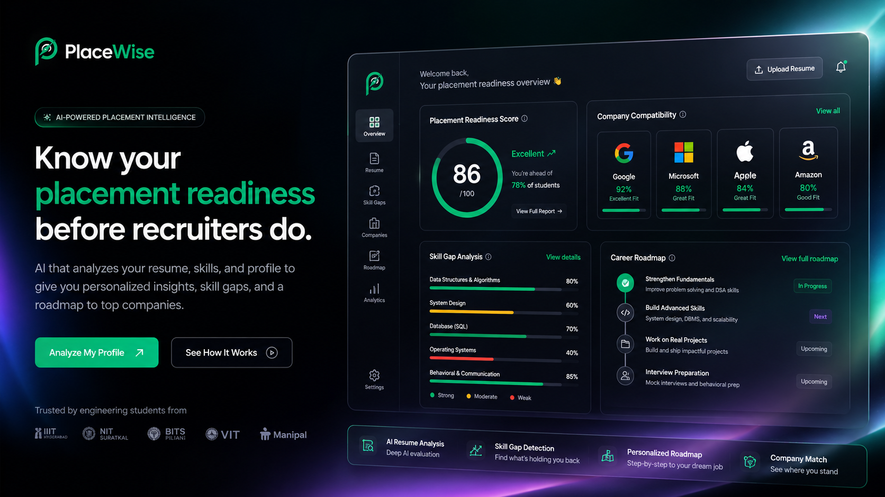

<p align="center">
  
</p>

<h1 align="center">PlaceWise</h1>

<p align="center">
  <strong>Know your placement readiness before recruiters do.</strong>
</p>

<p align="center">
  AI-powered placement intelligence platform for engineering students.
</p>

<p align="center">
  <a href="https://placewise-eta.vercel.app">🌐 Live Demo</a>
</p>

---

## 🚀 Overview

PlaceWise is an AI-powered placement intelligence platform designed to help engineering students understand where they stand before entering the job market.

Instead of providing generic resume feedback, PlaceWise analyzes your profile through the lens of recruiters, placement benchmarks, and company expectations to generate actionable insights that improve your chances of getting shortlisted.

Upload your resume and receive:

* Placement Readiness Score
* AI Recruiter Verdict
* Company Compatibility Analysis
* Skill Gap Detection
* Personalized Improvement Roadmap
* Shareable Placement Score Cards

---

## ✨ Features

### 📊 Placement Readiness Score

Get a comprehensive readiness score based on:

* Academics
* Projects
* Skills
* Experience
* Resume Quality
* Target Role Alignment

Understand exactly where your profile currently stands.

---

### 🤖 AI Recruiter Verdict

Receive a recruiter-style evaluation generated by AI.

The verdict highlights:

* Profile strengths
* Weaknesses
* Hiring signals
* Areas of concern
* Overall recruiter perception

---

### 🏢 Company Compatibility Engine

Discover how your profile aligns with leading technology companies.

Supported Companies:

* Google
* Microsoft
* Amazon
* Apple
* Meta
* Atlassian
* Razorpay
* CoinDCX
* Groww

PlaceWise identifies:

* Strong signals
* Missing signals
* Compatibility percentage
* Recommended improvements

---

### 🎯 Skill Gap Analysis

Identify exactly what is preventing your profile from reaching the next level.

Examples:

* Missing internship experience
* Lack of deployment skills
* Weak project impact
* Missing cloud technologies
* Limited open-source contributions

---

### 🗺️ Personalized Roadmap

Generate a detailed, personalized 4-week action plan tailored to your profile.

Includes:

* Technical skills to learn
* Projects to build
* Resume improvements
* Placement preparation strategy

---

### 📣 LinkedIn Share Cards

Generate beautiful placement score cards and share your achievements directly on LinkedIn.

---


## 🏗️ Architecture

```text
Resume PDF
     ↓
Document Parsing
     ↓
Groq LLM Extraction
     ↓
Candidate Intelligence Profile
     ↓
Role Benchmark Engine
     ↓
Company Compatibility Engine
     ↓
Placement Readiness Scoring
     ↓
Recruiter Verdict
     ↓
Skill Gap Detection
     ↓
Roadmap Generation
```

---

## 🛠️ Tech Stack

### Frontend

* Next.js 14
* TypeScript
* Tailwind CSS
* Framer Motion
* Vercel Analytics
* Vercel Speed Insights

### Backend

* FastAPI
* Python 3.11

### AI & Intelligence Layer

* Groq API
* LLaMA 3.3 70B
* ChromaDB
* Sentence Transformers

### Machine Learning

* XGBoost

### Deployment

* Vercel
* Railway

---

## 🚀 Local Setup

### Backend

```bash
cd backend

python -m venv venv

source venv/bin/activate
# Windows:
# venv\Scripts\activate

pip install -r requirements.txt

cp ../.env.example .env

# Add your GROQ_API_KEY

uvicorn main:app --reload --port 8000
```

API Docs:

```text
http://localhost:8000/docs
```

---

### Frontend

```bash
cd frontend

npm install

# Create .env.local

NEXT_PUBLIC_API_URL=http://localhost:8000

npm run dev
```

Visit:

```text
http://localhost:3000
```

---

## 📡 API Endpoints

| Method | Endpoint   | Description                |
| ------ | ---------- | -------------------------- |
| GET    | `/`        | Health Check               |
| GET    | `/roles`   | Supported Roles            |
| POST   | `/parse`   | Resume Parsing             |
| POST   | `/extract` | Skill Extraction           |
| POST   | `/analyze` | Complete Analysis Pipeline |

---

## 🎯 Supported Roles

```text
FAANG / Top Tier SDE

Product Company SDE

Service Company

ML / Data Roles

Core Engineering
```

---

## 🌍 Deployment

### Backend → Railway

```env
GROQ_API_KEY=your_api_key
```

Deploy the FastAPI backend to Railway.

---

### Frontend → Vercel

```env
NEXT_PUBLIC_API_URL=https://your-backend-url
```

Deploy the Next.js frontend to Vercel.

---

## 📈 Future Roadmap

* GitHub Engineering Credibility Analysis
* Resume Version Tracking
* Placement Progress Monitoring
* AI Mock Interviews
* Interview Question Generator
* Resume Benchmark Database
* Placement Analytics Dashboard
* College-wide Placement Insights

---

## 👨‍💻 Built By

### Vishnu Mashalkar

Computer Science Engineering @ BMSCE

* Full Stack Developer
* AI Enthusiast
* Building products for student career growth

Portfolio:
https://vishnu-portfolio-eosin.vercel.app

GitHub:
https://github.com/vishnu062006

---

<p align="center">
  Built for engineering students.
</p>

<p align="center">
  Transform placement preparation from guesswork into a measurable system.
</p>
